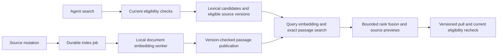

# Persistent semantic retrieval

This optional backend stores local passage embeddings in PostgreSQL. Its purpose
is to make relevant prior guidance discoverable when an agent uses different
words and the eligible collection exceeds the request-scoring worker's 64-note
limit. Deployment and improvement in real agent tasks require separate evidence.

## Data flow



The compiler retains responsibility for scope, sensitivity, applicability,
authority, mandatory instructions and competing positions. The index receives
eligible optional source versions and returns at most 100 note matches. A match
contains a record ID, version, body hash, similarity and original byte span.
The compiler validates that entire result before using it.

The SQL search joins the eligible versions, hashes and configured model identity
before computing distances. It uses exact cosine distance across the matching
passages, selects the best passage per note, then returns at most 100 notes.
There is no approximate vector index or post-search permission filter. The
compiler's existing 10,000-record scoped scan limit remains.

The compiler loads current sources in batches of 256 within its existing
repeatable-read transaction. It retains every scoped candidate and the same
privacy and applicability checks. Ordinary A/context notes can skip further
database reads only when that snapshot shows no scope authorization, forgotten
dependency, conflict membership or evidence reference. Other sources use the
full eligibility path. Candidate receipt details are written together; a failed
write rolls back the retrieval receipt.

## Derivation and currentness

Migration 056 adds `semantic_document`, `semantic_passage` and `semantic_job`.
It requires the PostgreSQL `vector` extension to be available to the installer.
The migration creates the extension when absent. Runtime agents do not receive
database credentials or an embedding-write operation.

A source insert, version change or lifecycle change updates the job queue in
the source transaction and removes old indexed passages. Forgetting excludes
vectors when the payload is excluded; ordinary deletion cascades through the
derived rows. SQL deletion retains the existing limitations for dead tuples,
WAL and backups.

Each indexing attempt has a two-minute lease. It reads the source, embeds outside
the transaction, and locks the current record followed by the job before
publishing. It verifies the lease, active lifecycle, version, body and payload
availability. An edit supersedes unfinished work. A failed attempt is retried
after a persisted delay that increases by five seconds to a maximum of five
minutes. A crashed attempt becomes eligible after lease expiry.

Opening the index schedules missing current documents and documents from another
model identity. The index is rebuildable from current sources. A model change
does not make old vectors eligible for the new query encoder.

## Model and process ownership

The prepared local CPU model is `BAAI/bge-small-en-v1.5` through FastEmbed 0.8.0.
The embedding worker returns 384-dimensional vectors and original UTF-8 byte
spans. It normally uses 128-token windows with a 96-token stride, including the
final shorter window. For unusually token-dense notes, the stride increases to
cover the whole source within 256 passages. Each passage is checked against the
model's input limit. The model identity includes model files, package versions,
encoder configuration, the passage worker's source hash and its imported scorer's
source hash.

The API owns separate persistent worker processes for query and document
embedding. Background work cannot occupy the query worker. A concurrent query
that finds its worker busy falls back immediately. Indexed search has a
two-second deadline; document exchanges allow up to 90 seconds, below the
two-minute job lease, so maximum-size sources have time to finish.
The owner cancels, reaps and joins both workers on shutdown. Workers receive a
restricted environment without the database DSN and use prepared local files.

## Ranking and delivery

New persistent searches use `cairn.semantic/16` and
`interleaved-scope-recency/1` through `/4`. They retain up to 100 lexical candidates
and up to 100 dense matches. At each rank, lexical comes first and dense second;
a record already exposed is skipped. Membership in both lists earns no extra
position. If one list ends, the other continues. The original channel ordering
is retained: lexical terms/scope/recency and dense cosine score/record ID.

Existing entity, failure-signature and quoted-text preferences remain outside
this ordering. Mandatory instructions remain independent of optional ranking.
Within an ordinary tier, each channel's first `k` records is exposed within at
most `2k` positions before packing. Outer preferences, whole conflict groups,
deduplication of equal bodies and context budgets can change delivered positions.
This is candidate exposure, not an applicability or confidence judgment. It can
promote a strong one-channel hit and demote a note favored by both channels.

Historical `cairn.semantic/15` packages with `hybrid-scope-recency/1` through `/4`
retain reciprocal-rank fusion exactly: each bounded list contributes
`floor(1,000,000 / (60 + rank))`, with ranks starting at one. Replay rejects mixed
schema/ranking contracts; it never applies the new rule to an old receipt.

`discovery.state: ready` means the indexed result passed validation. Its
`coverage.indexed` and `coverage.eligible` report coverage of the eligible source
set. New or changed notes that lack vectors can still appear through lexical
matching. During startup, with no indexed eligible notes, or after a worker or
index failure, the response is labelled `DEGRADED_NO_EMBEDDINGS` and uses lexical
selection. Invalid index output is also discarded as a whole.

An entry's `summary_span` continues to address exactly its displayed preview.
When available, `match_span` addresses the complete scored passage and can be
used as a bounded pull span. Class C instructions and marked competing positions
require whole pulls and do not expose partial-pull hints. A similarity score or
matched passage does not establish relevance or correctness; the consuming agent
must inspect the source before relying on it.

Historical recompile uses retained passage matches and ranking features, without
calling the model or consulting today's vector index. Existing package versions
keep their earlier ranking behavior. Pull still checks current source version
and eligibility, so a formerly valid hit cannot authorize stale delivery.

## Configure and verify

Prepare the local worker, make the extension available, and apply the repository's
normal installer migration before selecting the backend:

```sh
bash scripts/install-semantic.sh
cairn migrate
cairn serve --embedding-command "$HOME/.local/share/cairn/semantic/worker-embeddings"
```

Use the installation's existing database and identity configuration. The
installer does not change a running service. Choose one of `--embedding-command`,
`--semantic-command` or `--semantic-stream-command`; they cannot be combined.
`--semantic-idle-timeout` applies only to the request-scoring stream worker.

The existing search interface remains:

```sh
cairn agent --token-file "$HOME/.local/share/cairn/hosted-agent.token" search \
  --repo "$HOME/git/cairn" --task retrieval-check --run retrieval-check-1 \
  --semantic 'Where should persistent storage live?'
```

Read `discovery.state` and coverage, then inspect the returned source through its
pull arguments. Model unavailability does not imply an empty collection.
To disable this backend, remove its serve flag and restart the same API build;
retained receipts and lexical operation remain supported. Do not drop derivation
tables or roll back migrations as an ordinary configuration change.

Local regression coverage includes more than 64 eligible notes, source passage
location, partial coverage, invalid-result fallback, frozen replay, competing
positions, persistence across restart, concurrent editing, deletion and worker
shutdown. An optional real-model check uses `CAIRN_EMBEDDING_WORKER` together
with the disposable PostgreSQL test harness. These checks establish implemented
contracts. They do not establish fewer agent mistakes, lower owner intervention,
or acceptable latency across real active agents; those are outcome-trial criteria.
