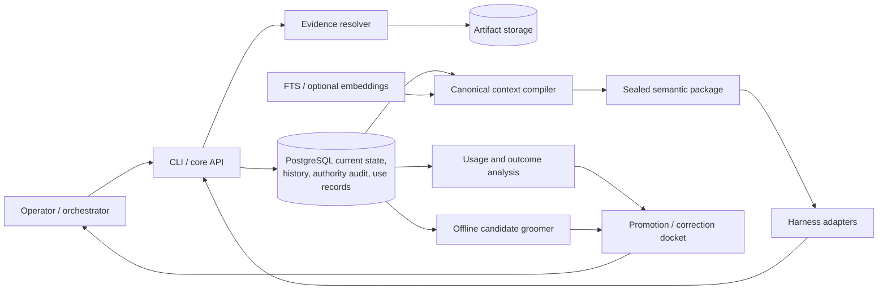
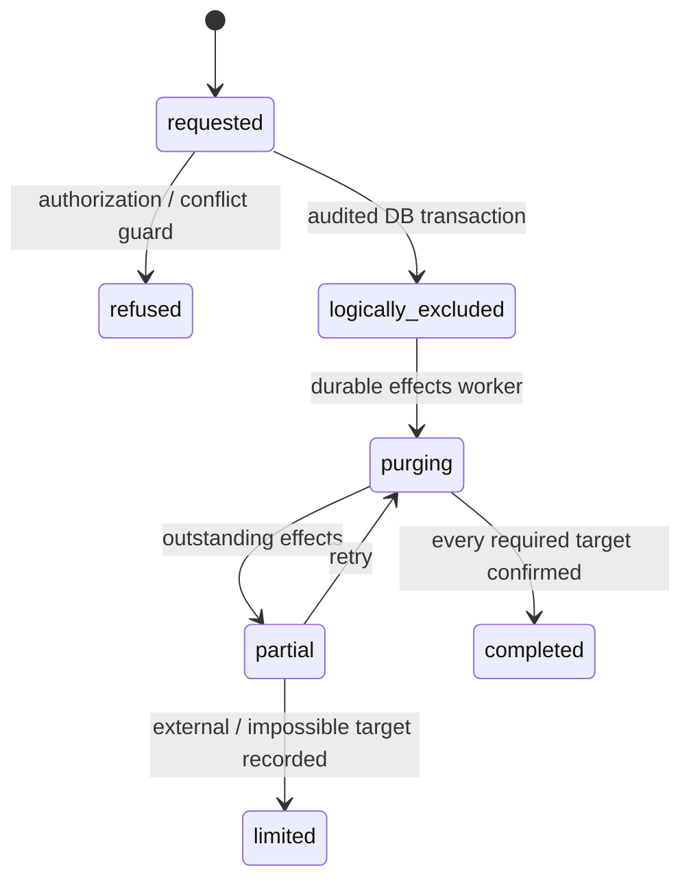

# Agent memory: implementation design

Version 1.0 · 2026-09-07 · Scribe: sol

Status: design for implementation planning, requested in #129. Consolidates the accepted Council decisions; it does not authorize deployment or resolve the remaining operator choices by implication.

## 1. Purpose and reading guide

Build a memory subsystem that earns its context cost by carrying useful, current knowledge between agent runs. Ordinary notes should be inexpensive to capture and revise. Claims used by consequential automation need evidence and correction history. Instructions and security changes need mechanical authorization and durable audit. These different needs share a transactional store, a context compiler, and adapters; they do not share an authority-grade ledger for every record.

The initial useful product is an OpenCode task wrapper that automatically delivers a small, destination-appropriate package before a run, records what it supplied, and uses subsequent outcomes to improve the next run. The initial implementation must also support manual promotion, correction, conflict handling, evidence degradation, and attribution reconciliation. Richer adapters and an offline grooming model follow a working measurement loop.

This document specifies the contracts against which migrations, APIs, adapters, jobs, and acceptance tests can be planned. Table shapes are logical schema contracts, not executable migrations. Exact SQL, language, packaging, and integration entry points are implementation work.

Read §§2–4 for scope and architecture; §§5–10 for storage and lifecycle; §§11–15 for compilation, adapters, and usefulness; §§16–20 for operations, acceptance, and implementation planning. §§21–23 provide worked examples, unresolved choices, and source traceability.

Quick links: [schema](#5-record-taxonomy-and-logical-schema) · [authority and concurrency](#7-authority-transactions-and-concurrency) · [compiler](#11-context-compilation) · [adapters](#13-adapter-contract-and-conformance) · [usefulness](#15-making-memory-useful) · [acceptance](#18-acceptance-and-verification) · [implementation plan](#19-implementation-plan-and-dependencies) · [open decisions](#22-open-decisions-and-planning-refinements).

### 1.1 Decision precedence

1. Operator rulings and the operator-authored [producer-attribution correction](../synthesis/producer-attribution-correction.md) take precedence.
2. The resolved portions of [provenance synthesis v3](../synthesis/provenance-synthesis-v3.md) and [usefulness synthesis v1](../synthesis/usefulness-synthesis-v1.md) govern the design.
3. [Bonded Memory](../../../bonded-memory.html), read as revision 3, supplies implementation detail where compatible with those decisions. Its current revision already incorporates the attribution correction and usefulness round.
4. The original RFP supplies scenarios and adapter requirements only where not superseded by #67 and later rulings. Earlier individual proposals are historical inputs.

The correction withdraws the claim that Bonded Memory intended a caller-controlled producer identity. The replacement is store-assigned writer identity plus optional, reconcilable attribution of who performed delegated work. This document does not reproduce the withdrawn premise or require a universal two-block asserted/observed envelope.

**Planning refinements** below close mechanical gaps without claiming additional Council votes. **Open decisions** in §22 need explicit resolution before the dependent feature ships. Existing numerical targets are evaluation hypotheses, not measured performance or automatic policy changes.

## 2. Scope, environment, and trust

### 2.1 Initial deployment

| Component or integration | Design position |
|---|---|
| Operational database | PostgreSQL; no SQLite prototype stage |
| Large evidence | Object storage or a managed local artifact directory behind the same evidence interface |
| Entry points | Local CLI and core library; optional MCP facade; no new cross-machine service required |
| First adapter | OpenCode H0 wrapper for Striatum builds, including hosted GLM/DeepSeek destinations |
| Rich adapter target | agy H3, subject to probing the actual driver boundary |
| Other conformance targets | Claude Code and Codex at empirically demonstrated levels |
| Hermes | Present and used interactively; not an initial build-adapter target |
| Striatum | Source of execution evidence, decisions, corrections, and outcomes; its own records remain upstream authority |
| Council | Explicitly submitted public material/candidates; private member sessions are not a capture source |
| Git | Schemas, fixtures, policy source, exports, and implementation code; never the operational memory database |

Harness presence and usage follow the operator's #98 correction. Presence establishes no hook, mediation, or compaction capability. Historical corpus counts (278 decisions, 159 RFCs) are source-era planning references; Stage 0 inventories current material rather than treating those counts as current facts.

### 2.2 Threat model and proportional controls

The orchestrator and operational database are trusted. An existing authority-signing service, if used, is also trusted; checkpoint signing is not required. Agents have authorized interfaces, not raw database administrator access. Light principal authentication is deliberate. Per-agent database roles, a column-grant matrix, external witnesses, off-box keys, Byzantine replication, and resistance to a malicious DBA are outside this baseline.

The dominant local failure is a mistaken or over-eager agent submitting plausible but false information, concealing a failed delegation, confusing binding availability with capability, or turning a repeated claim into apparent corroboration. Prefer making such errors visible and correctable. Retain hard gates for authority conferral, consequential eligibility, destination restrictions, scope broadening, deletion authorization, and atomic state changes.

Imported repository documents, web content, and native-memory files remain potentially malicious. Light local authentication does not relax their quarantine, class ceiling, or instruction-channel restrictions. Typed delivery reduces accidental authority laundering; it does not prove that a language model will ignore an injected instruction in data.

A correctly identified caller can lie about facts. `instrumented` means a trusted adapter observed an event; it does not mean that a tool, delegate, or assertion was correct. A signed or hashed false submission would still be false.

### 2.3 Non-goals

- Universal event sourcing, immutable physical retention, content-addressed record identity, or complete derivation ancestry.
- Cryptographic commitments for ordinary memory, signed audit heads, Merkle trees, global ordering, or decentralized consensus.
- Replacing Striatum's ledger, Council's conversation authority, harness sessions, or a personal knowledge graph.
- Capturing private Council sessions, hidden reasoning, all prompts, all outputs, or entire workspaces.
- Inferring personal traits or promoting agent content through repetition, popularity, or a confidence score.
- Claiming runtime enforcement from prompt inclusion, file availability, or an adapter's unverified descriptor.

## 3. Semantic invariants

| ID | Invariant | Primary enforcement |
|---|---|---|
| I1 | Every retained memory has stable logical identity, class, attribution, scope, timestamps, lifecycle, sensitivity, and version | Schema plus ingest stamping |
| I2 | Authority transitions are authenticated, authorized, atomic, auditable; agents cannot confer authority on their own output | Live grants, author identity, transaction-bound audit |
| I3 | Concurrent edits never silently overwrite one another | Expected version/CAS; locks for privileged transitions |
| I4 | B/C corrections preserve enough history to explain current state and consequential use | Retained consumed versions, correction links, authority audit |
| I5 | A read set is a consistent snapshot; only dependent transitions require ordering | MVCC transaction; explicit dependency references |
| I6 | Consequential claims retain supporting evidence references | Promotion checks and evidence availability states |
| I7 | Privileged audit identifies actor, authority basis, previous/resulting state, reason, transaction | `authority_event` and immutable references |
| I8 | Indexes, embeddings, caches, summaries, and packages are non-authoritative and rebuildable | Rebuild recipes and conformance drills |
| I9 | Logical identity, payload integrity, and physical retention are separate | Tombstones, redactable payloads, deletion effects |
| I10 | Cryptography is used only for a stated integrity need | Evidence digests, package seals, unsigned C/D range checkpoints |
| I11 | No implicit evidence-to-instruction conversion, scope expansion, or self-corroboration | Class/purpose gates and explicit authority events |
| I12 | A disputed item cannot be delivered without its qualifying conflict representation | Atomic conflict allocation; blocking unresolved binding conflict |
| I13 | Bootstrap precedes the first model action; delivery and enforcement are different facts | Wrapper/adapter contract and observed receipts |
| I14 | Native memory and untrusted imports do not acquire canonical authority | Declared interlocks, quarantine, candidate admission |
| I15 | Service-observed events and model testimony remain distinguishable | Ingress-assigned witness and attribution reconciliation |
| I16 | Context use and capture remain proportional | Optional token ceiling, class-specific receipts and retention |

## 4. Architecture and ownership



| Boundary | Owns | Must not infer or own |
|---|---|---|
| Orchestrator | Authenticated channel identity; task/run/attempt identity; actual delegation spawn and terminal events; execution control | Memory permissions from caller assertions |
| Memory core | Current memory, grants, lifecycle, evidence links, correction history, authority audit, reconciliation, consistent reads | Whether a model understood or obeyed delivered content |
| Compiler | Applicability, conflicts, budget, canonical semantic package, omission explanations | Harness-specific APIs, authority creation |
| Adapter | Rendering, contact/delivery evidence, observed lifecycle, declared interlocks and mediation | Changing record meaning, promoting candidates, claiming unobserved capabilities |
| Evidence resolver | Controlled artifact access, verification state, retention status | Claim truth or global corroboration |
| Groomer | Bounded proposals, summaries, clusters, source-linked docket entries | Admission, grant changes, scope broadening, direct rank changes |
| Operator | Root authority, policy ownership, unresolved operational parameters | Hand-authoring the measurement corpus as routine work |

Core and compiler use capability descriptors and destination permissions, not branches named after harnesses. Integration-specific logic belongs in adapters. The CLI and MCP facade share the same validation and transaction code.

A single database service identity is sufficient for the baseline. Agent processes do not receive its unrestricted credentials. The trusted gateway may run in-process inside the orchestrator or as a local endpoint; a subprocess CLI must receive an orchestrator-bound channel identity. A caller-controlled `--principal` flag is not authentication.

## 5. Record taxonomy and logical schema

### 5.1 Independent dimensions

Record class describes consequences and provenance requirements. Record kind describes meaning. Witness describes observation channel. Actor kind and grants describe authority. Lifecycle describes current eligibility. These are independent fields, not a scalar trust ladder.

| Class | Examples | Minimum beyond I1 | Mutation and history |
|---|---|---|---|
| A: ordinary | Notes, observations, provisional lessons, nonbinding preferences | Row version; no evidence requirement | Cheap edits with bounded ordinary revisions; unreferenced hard delete allowed |
| B: consequential | Placement claims, capability assessments, planning lessons, security facts | Explicit scope, promotion event, supporting evidence references, correction history | New preserved versions for consequential changes; consumed content retained under policy |
| C: authority | Rulings, instructions, policy, grants, waivers, revocation, scope broadening | Authenticated actor and live authority basis | Every transition audited atomically; payload can be redacted through D |
| D: security/deletion | Redaction, forgetting, access-policy changes, incident corrections | Authorized actor, targets, explicit effects and completion state | Append audit plus tracked asynchronous effects |

C is not universally “B plus evidence”: an authorized human instruction can originate directly as C. Its authority basis is required; an experimental receipt is not. Likewise, a D deletion request is not a promoted note. B promotion and direct C/D creation all need correctly typed audit links, not the literal sequence A→B→C→D.

Kinds initially include `note`, `observation`, `claim`, `lesson`, `procedure`, `decision`, `preference`, `instruction`, and `policy`. A preference that binds behavior is C; one offered as optional context is A. `testimony` can be deliberately captured as evidence of what someone reported; it never becomes an instrumented observation merely because it is cited.

### 5.2 Vocabulary mapping

| Earlier term | Representation here |
|---|---|
| `untrusted` | Import source/taint, quarantine scope, testimony, A ceiling |
| `agent-claim` | Claim kind, testimony, identified writer, initially A |
| `agent-observation` | Observation kind; instrumented support referenced separately |
| `runtime-receipt` | Service/adapter-owned event, `instrumented` witness |
| `corroborated` | A qualified evidence assessment; never a grant or numeric authority rank |
| `operator` / `operator-ruling` | Human actor plus live grant; C ruling if binding |
| `attested` | Verification metadata and referenced attestation; does not increase authority by itself |
| `admitted` | Lifecycle/promotion result with a specific event, not a new producer class |

Numeric A0–A6 authority scales are retired. A–D are record classes, not those scales.

### 5.3 Principal tables

| Table | Key and essential fields | Contract |
|---|---|---|
| `memory_record` | `record_id: UUID`, current version, class, kind, scope, sensitivity, lifecycle, creation/promotion/authority event refs | Authoritative current-state pointer and eligibility |
| `record_version` | `(record_id, version)`, proposition/payload ref, payload digest, observed writer, written time, optional reported time, witness, attributed producer/state, producer run, scope/validity pins | Preserves consumed B/C meaning; A versions prunable |
| `record_correction` | Correction UUID, subject old/new version refs, type, actor, reason, time | Explains B correction, supersession, retraction; not a cryptographic log |
| `record_relation` | From/to version or identity, typed relation, creator/time | `corrects`, `supersedes`, `retracts`, `contradicts`, optional `derived_from`, `specializes` |
| `evidence` | Evidence UUID, source kind, witness, observed capturer/time, locator, as-captured digest/version, sensitivity, retention state | Deliberately captured, write-once content identity; lifecycle can change |
| `evidence_ref` | Ref UUID, citing record version, evidence UUID, relation, cited revision/span/digest | Links a precise claim version to support; link remains when bytes disappear |
| `authority_event` | Event UUID, optional numeric index, subject/type, actor, grant chain refs, old/new state refs, reason, transaction, time | Insert-only audit via ordinary API; C/D state change shares transaction |
| `authority_grant` | Grant UUID, principal, capabilities, scope, parent grant, validity, grant/revoke event refs, version | Current authorization state; chain checked at use |
| `conflict_group`, `conflict_member` | Group UUID, member version refs, scope, blocking status, opening/resolution refs | Dissent and resolution retained independently of selection rank |
| `delegation_attempt` | Attempt UUID, dispatcher, delegate, task/run, spawn time, terminal state/time, outcome receipt | Orchestrator-owned fact, not an agent claim |
| `record_use` | Use UUID, record/version, consumer task/run/decision, purpose, retrieval receipt, snapshot provenance, time | Durable consequential exposure, written by core before return |
| `usage_observation` | Observation UUID, use/delivery ref, signal, observer, time, inference method if applicable | Append observations; derived highest usage level can be rebuilt |
| `task`, `run`, `execution_attempt` | Stable task, run, attempt IDs; capability identity; execution binding; workspace and policy pins; opaque harness session refs | Separates work identity, execution identity, and harness state |
| `retrieval_receipt`, `delivery_receipt`, `outcome_receipt` | Receipt UUIDs and schemas in §12 | Durable only under the class/purpose rules; telemetry otherwise |
| `deletion_request`, `deletion_effect` | Authorized request and per-target status, attempts, residuals, timestamps | Tracks physical effects outside the DB transaction |
| `docket_item` | Candidate/source refs, reason, priority, state, review result | Proposals and demand; never authority by existence |
| `audit_checkpoint` | Checkpoint UUID, covered audit membership/range, count, digest algorithm/version, digest, snapshot/export refs | Unsigned restore integrity metadata |
| `projection_state` | Projection name/version, generation, source freshness marker, rebuild state | No authority; records lag and rebuild recipe |

**Planning refinement:** a normalized `(record_id, version)` model makes references to consumed content unambiguous. `superseded_by` and `is_current` can be materialized conveniences; they are not separate sources of truth. Stable logical IDs remain independent of content digests.

### 5.4 Common validation

- IDs, class, kind, lifecycle, scope, sensitivity, writer, time, and version are required. Unknown enum/schema values are rejected with a structured error.
- Content, list sizes, relation counts, scope complexity, and request size are bounded by versioned limits. SQL receives parameters, never caller fragments.
- Every B version has a valid promotion lineage and evidence links. Every C/D subject has a matching authority event of the proper type. A non-null foreign key alone is insufficient: validate subject, transition, resulting version, and transaction.
- No self-referential correction/supersession link, cycles in grant ancestry, or accidental second current version.
- A digest is an integrity/dedup field. Identical text does not imply identical assertion, run, action, or lifecycle.
- Security-sensitive metadata, including locators and attribution, carries sensitivity and access restrictions too.

## 6. Identity, witness, and attribution

### 6.1 Store stamping

At ingress the core unconditionally assigns `observed_writer`, `written_at`, `witness`, initial version, and transaction metadata from trusted channel context. It stamps authority actors, use times, and use-snapshot metadata similarly. Caller-supplied copies cannot override these fields.

The orchestrator establishes channel identity independently of request JSON. The core initializes transaction-local identity/channel settings on every database transaction; a pooled connection must not retain the previous caller's identity. Missing trusted context fails the write. Ordinary ingestion needs no signature.

`written_at` is the store's transaction time, not proof of when an external event happened and not necessarily the instant of commit. Optional `reported_occurred_at` is testimony. A runtime event time is instrumented only when the trusted adapter observed it. Preserve the original observed writer on a version; log later editors on new versions so editing does not erase authorship used by self-promotion checks.

`witness = instrumented` is available only to trusted observation channels. A model asking to run tests remains a requester. The runner's exit-code receipt is instrumented; “the tests passed” in generated prose remains testimony. Quota errors can be instrumented without being evidence of model incapability.

### 6.2 Delegation reconciliation

Who wrote a row and who performed the work are separate questions. `attributed_producer` is optional testimony, displayed alongside `observed_writer`. Attribution state is computed by the core, not accepted from the caller.

| Condition | Result |
|---|---|
| No different producer attributed | `self` |
| Matching service-owned completed attempt and corresponding result reference | `reconciled` |
| No matching attempt, still-running attempt, ambiguous retry, or unavailable result correspondence | `unreconciled` |
| Cited matching attempt ended `failed`, `timeout`, `killed`, or `no_result` despite a completion claim | `contradicted` |

The orchestrator records a delegation attempt at the spawn boundary and later its terminal state. Dispatch intent is not a successful spawn. A crash between dispatch intent and process creation leaves an explicit unknown/recovery condition; it is not upgraded to spawned from agent testimony.

**Planning refinement:** records cite an `attempt_id` and, where available, the returned artifact/receipt. Matching only task and delegate would incorrectly reconcile against a different successful retry. A completion claim and a partial-result claim must also be distinguishable: useful partial output from a failed attempt does not prove completion. `reconciled` confirms correspondence to the observed attempt, not correctness or independent corroboration.

On contradiction the core:

1. Preserves the submission as fallible A material with the mismatch visible.
2. Refuses promotion and bars capability inference from it.
3. Queues a correction ahead of ordinary promotion candidates.
4. Creates one idempotent A failure observation from the service's actual terminal receipt, recovering the otherwise suppressed failure.
5. Re-evaluates affected records when the attempt status is finalized or corrected.

Unreconciled records likewise cannot promote or support capability assessment. A periodic query flags completed tasks with open delegation attempts. This detects an abandoned failure path even when nobody fabricated a completion record.

The delegation schema and this reconciliation are Stage 1 requirements. If an integration cannot report service-owned attempts, its cross-producer claims stay unreconciled; a model-authored substitute is not acceptable evidence.

## 7. Authority, transactions, and concurrency

### 7.1 Authority event contract

Every privileged event records:

```text
event_uuid, event_type, event_class(C|D), subject_kind, subject_id,
expected_version, previous_state_ref, resulting_state_ref,
actor_id, actor_kind, authority_basis(grant IDs + versions + parent chain),
reason, transaction_id, occurred_at, optional depends_on_event
```

State refs address retained versions or non-sensitive audit metadata sufficient to explain the transition. Avoid embedding secret payloads in immutable audit JSON. Optional digests identify the pre-redaction content without making its retention mandatory. Physical deletion progress lives in effect rows and appended status events, not mutations of the initial authority event.

Event types include promotion, instruction issuance/revocation, scope broadening, grant/delegation/revocation, waiver, dispute resolution, access-policy change, redaction, forgetting, incident correction, and key rotation if a key-bearing integration exists. Closed enums and legal-transition tables are versioned schema artifacts.

### 7.2 Validation rules V1–V8

| Rule | Implementation contract |
|---|---|
| V1 no self-authority | Promoting agent-derived content cannot be performed by its observed producing principal. Attributing it to someone else does not change this. An independent service actor must possess a constrained live grant; identity difference alone is not authorization. |
| V2 live authority basis | Actor has the required capability within target scope; all parent grants are live, valid, and unrevoked in the transition transaction. |
| V3 expected state | Lock subject and match expected version/state; stale callers receive a conflict, never a silent merge. |
| V4 atomic audit | Exact authority event and corresponding subject change commit together. Validate the matching subject, type, and version, not merely that any event exists in the transaction. |
| V5 retry idempotency | Same event/request UUID and same canonical request return the original result; same UUID with different content is a conflict. |
| V6 reason | Nonempty explanatory reason; baseline length 8–4000 trimmed characters. Length validation does not establish substantive truth. |
| V7 scope monotonicity | Ordinary edits and derived candidates cannot widen scope; widening needs the capability and an explicit C event. |
| V8 bounded delegation | No cycles; child scope/capabilities/validity are contained in parent; configured depth limit, proposed default 2. |

Direct operator rulings and initial root-grant installation are distinct from agents promoting their own claims. **Open decision O4** pins the root bootstrap and direct-human-authoring path; do not ship an all-purpose `bypass_self_authority` switch. Subsequent grant changes use the normal audited interface.

### 7.3 Transaction matrix

| Operation | Isolation / concurrency | Commit result |
|---|---|---|
| A edit | READ COMMITTED; `UPDATE … WHERE version = expected` | New current version; bounded ordinary history |
| B correction | Transaction with CAS on current version | Retained old/new versions plus correction and affected evidence links |
| C/D transition or promotion | SERIALIZABLE; subject `FOR UPDATE`, grant chain `FOR SHARE` | Authority event plus state mutation atomically |
| Multi-record compile/query | One REPEATABLE READ snapshot | Consistent eligibility, versions, policy, conflicts, receipts, and use rows |
| Evidence availability refresh | Versioned resolver result, CAS where it changes eligibility | Visible availability/degradation without rewriting captured evidence |
| External deletion | Transaction creates request/effects; worker performs effects idempotently | Logical exclusion commits before asynchronous purge |

Lock ordering is stable (grant ancestry and then sorted subject keys under one documented convention). Serialization/deadlock retries are bounded and rerun validation from a fresh transaction. Unique request keys cover ambiguous success after a lost response. Retrying cannot duplicate a promotion or deletion job.

A grant revocation and a concurrent authorized action must have a valid serial order. If the action locks the grant and commits first, it was authorized before revocation; if revocation wins, the later action is denied or retries and then is denied. Do not require every wall-clock overlap to fail. Revocation takes effect on subsequent authorized operations and refresh boundaries, not retroactively on earlier commits.

No global total order is required. Numeric event sequences can have gaps and can be allocated before another transaction commits. They are not commit order or truncation detectors.

### 7.4 Idempotency and deduplication

Use request UUIDs, scoped to the observed caller and operation, for retries on all mutation APIs. Store a canonical request digest to detect key reuse with different content. Content similarity/digest dedup is a separate candidate-clustering feature.

**Planning refinement:** a permanent unique `(content_hash, writer, task)` key or `(verb, target, actor, basis)` key would collapse intentional retract-and-resubmit or re-issue actions. Preserve these as optional duplicate hints within a capture operation, not universal identity. A new intended event gets a new request UUID; a transport retry reuses the old one. Repetition never becomes corroboration or a class change.

### 7.5 Snapshot and replay contract

One compile runs against one MVCC snapshot. If several calls require that same live snapshot, the core holds a short-lived server-side transaction/cursor with a bounded lease; expired handles return `SNAPSHOT_EXPIRED`. An exported PostgreSQL snapshot is usable only under PostgreSQL's transaction-lifetime rules.

A `transaction_id` or `snapshot_txid` in a receipt is audit provenance, not a durable time-travel handle. Durable replay uses retained record-version IDs, policy/grant/evidence-check versions, ranking inputs, and canonical package content. If A history or a payload has been pruned/redacted, replay reports the missing material and its limitation; it cannot recreate bytes from a digest.

## 8. Promotion, scope, currentness, and conflict

### 8.1 Purpose and A→B boundary

`purpose=context` permits appropriately framed A/B/C context. `placement`, `capability`, `planning`, and `security` return eligible B/C inputs only and create `record_use` rows. D is reached through security/audit/status interfaces; relevant effects become revocation/status notices, not generic instructions.

The consequential consumer supplies purpose and decision/run identity. The core records the crossing before returning decision inputs. Ordinary material can be inspected as a lead, but using it in a consequential action requires promotion or re-establishment with evidence at that time.

Promotion requires explicit scope, supporting resolvable evidence, reconciled/self attribution, an authorized non-producing actor, expected version, and a C audit event. If deliberately captured evidence was already linked at creation, a separately delegated descriptive-only service may perform the gate. That automation is disabled until its constrained grant policy is approved.

Without that evidence, create a new B claim from newly established evidence, linking the old A note only as a lead if useful. Never backdate capture or relabel the earlier note as having been instrumented. A blocked request creates `escalation_blocked` demand for the docket; the consumer receives a safe reason and no ineligible decision input.

**Boundary limitation:** SQL cannot stop an unconstrained agent from reading advisory context and later using it to make a decision. Known consequential orchestrator paths must invoke the purpose-gated API. H0 cannot promise to observe every decision inside a closed harness. This is a declared conformance limit, not a reason to classify all ordinary context as B. Where a known consumption boundary is ambiguous, use the stronger class as ruled in #75.

### 8.2 Demotion and corrections

B→A is a cheap CAS update affecting future eligibility only. Refuse it while a C record or an open conflict cites the record. Consumed B versions, promotion events, and use history survive under their retention obligations. This demotion is separate from removing an optional item from the bootstrap push set.

B corrections create a new retained version and a reasoned correction/supersession reference. They do not require complete ancestry. Expiring old consumed payloads is an audited D operation under retention policy. C changes always use authority events; an edited policy source file is merely a proposed policy revision until that transition occurs.

### 8.3 Scope and applicability

Scope is a typed conjunction over applicable dimensions: operator/security domain, project/repository, revision/artifact, task/run, role, environment, capability identity, execution binding/provider, destination class, and time. Each record kind has a schema specifying its required dimensions.

**Planning refinement:** distinguish explicit wildcard, explicit constraint, and unbound/unknown. Do not interpret an omitted repository as every repository. A C record missing a required applicability binding is inapplicable; an explicit global scope requires authorized creation/broadening. Dimensions irrelevant to a kind need not all be filled with arbitrary values. Compile scope with a tested predicate, not an ambiguous JSON containment shortcut.

Derived scope is no broader than its sources and actor permissions. Specificity does not override a stronger binding policy. Cross-project usefulness never widens a record automatically.

Currentness uses lifecycle, explicit validity intervals, revision/workspace pins, evidence availability, supersession/retraction, live authority, and policy. Recency is only a retrieval tiebreak. Dirty workspaces have an explicit pin or declared uncertainty; branch names alone do not identify code. Historical reads are labelled historical and cannot activate a revoked policy by selecting an old `as_of` time.

### 8.4 Conflict contract

Deterministic conflicts on overlapping structured scope/keys and explicit user disputes are supported in Stage 1. An LLM can propose semantic contradictions later; it cannot adjudicate them or manufacture consensus.

A conflict group retains member versions, dissent, opening evidence, blocking classification, and any resolution event. A selected disputed item is allocated atomically with its marker and the qualifying competing positions. Optional groups may be omitted as a whole with a receipt. Applicable mandatory/binding conflicts cannot be omitted to make a run appear unambiguous.

Unresolved binding C conflict blocks the affected action by default. Advisory B disagreement may be delivered as disagreement; where policy allows action, mark the run `acted_under_open_conflict`. A resolution by an interested party preserves that fact and dissent rather than silently erasing the dispute.

If a conflicting counterpart is prohibited at the destination, disclose only an authorized conflict/status notice; fail or route the affected mandatory action according to policy. Never leak the counterpart through a conflict marker, omission explanation, or expansion handle.

Deletion or retraction intended to erase an open conflict is refused and the refusal recorded. Emergency secret removal in such a record is an explicit unresolved precedence issue (§22 O6), not an implicit deletion bypass.

### 8.5 Lifecycle transition contract

The initial lifecycle vocabulary is `active`, `disputed`, `evidence_degraded`, `superseded`, `retracted`, and `tombstoned`. Conflict membership and evidence verification are also stored independently: a disputed record may simultaneously have degraded evidence. A display status must not hide either condition; eligibility evaluates both even if a legacy API exposes one primary lifecycle label.

| Transition | Preconditions | History / effect |
|---|---|---|
| New → active A | Valid ingress, scope, sensitivity and attribution metadata | Cheap ordinary version |
| A → B | §8.1 promotion gate and V1–V8 | C promotion event and retained promoted version |
| Active → disputed | Valid explicit dispute or deterministic rule over overlapping scope | Conflict membership; no class/authority change |
| Active/disputed → evidence-degraded | Resolver result changes cited availability | Evidence status retained; consequential gate reevaluated |
| Evidence-degraded → eligible | Verified support restored/re-established under policy | New check/reference version; old failed check remains explainable |
| B → corrected/superseded B | Expected version, authorized edit, explicit replacement/reason | Retained old/new versions and correction relation; no scope widening |
| B → A | No live C/open-conflict citation; CAS | Future-eligibility change; prior consumed versions/audit/use survive |
| B → retracted | Impact preview, expected state, no conflict-erasure violation | Retraction/correction history; future consequential exclusion |
| C issue/change/revoke | Authorized transition with live grant chain | Atomic audit and current state; affected packages refresh at supported boundary |
| Retained → tombstoned | D authorization where required; deletion/conflict guards | Logical exclusion, minimal identity, physical effect jobs |

Restoring resolvable support does not undo a retraction, supersession, or authority revocation. A new explicit transition is required where policy permits reinstatement. Expired validity makes a record inapplicable without needing a timer to rewrite every row.

## 9. Evidence and reverse impact

### 9.1 Evidence capture and reference semantics

`evidence` is a distinct schema entered deliberately. Attachments and ordinary notes do not become evidence on arrival. Captured evidence is write-once at capture: correcting its meaning or bytes creates a new evidence object and relation. Retention, availability, sensitivity, and deletion state may change without rewriting the original capture claim.

Small receipts can live in PostgreSQL; large artifacts use managed storage. A citation names evidence ID, exact version/digest and optional span, source kind, capture time, and retention state. A URL without retained or version-pinned bytes is a locator, not immutable proof. Fetching it later establishes what was fetched later.

Resolver states are:

- `resolvable`: required retained/versioned material is accessible and verifies against the cited digest/version.
- `divergent`: material exists but differs from what was cited.
- `dangling`: identity is known but material is unavailable, deleted, expired, or was never retained.

Resolver checks record algorithm, checked time, source generation, and error class. Timeouts are availability uncertainty, not proof that evidence is false. Restrict resolver schemes/paths and destination access; imported URIs are not authority to fetch arbitrary host files or network endpoints.

### 9.2 Degradation rule

The accepted baseline blocks a B record from consequential reads when **no resolvable evidence reference remains**. One dangling reference among three does not block it if another is resolvable. All degradation remains visible; degraded records cannot undergo further promotion or scope broadening. A specific C policy/waiver can permit otherwise blocked use and is pinned in the use receipt.

This is a minimum availability test, not proof that the remaining evidence is sufficient. If a claim depends on several required premises, a future or domain-specific approved policy must express that dependency; do not silently treat one surviving unrelated reference as scientific validation. Required evidence-set semantics are listed in §22 O7 as a refinement beyond the accepted existential default.

### 9.3 Reverse impact

On every consequential returned record/version, the core inserts a `record_use` linked to the query receipt, purpose, and consumer before return. It means exposure to a consequential consumer, not proven influence. Usage observations and outcomes refine that fact later.

Impact queries combine:

1. Direct consumers of the affected versions.
2. B/C records citing affected evidence or versions.
3. Consumers of explicitly corrected/superseded derived claims where known.

Index both directions of evidence and relation edges and `(record_id, version, used_at)` on use rows. Full derivation DAGs are not required. Default traversal may be bounded, but returns `truncated=true` and a continuation; it must never report a bounded result as complete blast radius.

Retraction previews affected records and runs before committing. The mutation rechecks relevant state under transaction locks; a stale preview is not deletion authorization for changed targets. Invalidation updates eligibility synchronously where required and schedules broader re-evaluation through a durable outbox. Downstream cached graph views are disposable.

## 10. Deletion, redaction, and retention

### 10.1 Deletion workflow



The authorized transaction identifies all versions and known dependent artifacts, writes D audit, removes the payload from current eligibility, retains necessary tombstone/links, and creates per-target effect jobs. No external storage call is held inside a database transaction expecting cross-system atomicity.

Each effect has target ID/type, requested action, actor/request, status (`pending`, `running`, `completed`, `failed`, `not_possible`), attempt count, last error, observed completion time, and residual explanation. Workers retry idempotently. A partially successful request never reports complete deletion.

Targets include DB payload/version rows, artifact objects, FTS/vector indexes, summaries, cached packages, overlays, controlled native files, exported backups, and known provider deliveries. Ordinary uncited A can be hard-deleted. Cited A deletion upgrades to D, retains a tombstone, and invalidates/flags dependent evidence. Evidence metadata remains as a minimal tombstone even after object purge.

Provider-retained content and user files outside managed ownership may be `not_possible`. Backup copies remain a residual until rotation or a separately enabled cryptographic erasure mechanism is confirmed. A request can be operationally closed with explicit limits, but its status must distinguish that from complete physical erasure.

### 10.2 Retention policy

| Material | Baseline obligation | Proposed configurable retention |
|---|---|---|
| Ordinary A revisions | Bounded history; no authority-grade retention | Source default: last 10 revisions / 90 days; exact pruning rule to pin |
| Consumed B payloads/corrections | Explain consumed state and corrections; pruning audited D | Source default: record lifetime + 1 year; operator policy must define lifetime |
| Authority audit and essential tombstones | Durable actor/basis/effect history; no ordinary delete path | Retain non-sensitive audit metadata; payload redaction remains possible |
| `record_use` | 90-day floor; auto-extend while affected decisions are live or reviewable | Requires explicit consumer reviewability lifecycle; no guessed expiration |
| Durable retrieval/delivery receipts | Preserve required use, enforcement, and correction explanation | Compact after 90 days only if dependencies and required fields survive |
| A-only telemetry | Best-effort operational measurement | Short bounded retention; not a provenance obligation |
| Evidence artifacts | Explicit capture/retention class | No universal physical permanence |
| Projection data | Rebuildable | Purge/rebuild freely subject to current access policy |

Deletion of history needed by live impact analysis requires D audit and records the resulting loss of explainability. `record_use` retention does not force retention of secret payloads; retain redacted references and the authorized deletion event.

Digests, object paths, reasons, and producer names can themselves reveal sensitive information. Tombstones are access-controlled and retain only necessary metadata; do not expose them to models by default. A digest is not anonymization.

## 11. Context compilation

### 11.1 Request contract

```json
{
  "schema": "memc.compile.request/1",
  "request_id": "<uuid>",
  "task_id": "<task>",
  "run_id": "<run>",
  "purpose": "planning",
  "intent": "bootstrap",
  "query": {"text": "repair build failure", "entities": ["repo:example"]},
  "scope_pins": {"repo": "example", "role": "implementer"},
  "revision": {"head": "<commit>", "workspace_snapshot": "<snapshot>", "dirty": false},
  "policy_revision": "<policy-version>",
  "as_of": "<store-accepted-time>",
  "destination_binding": "<orchestrator-resolved-binding>",
  "adapter_profile": "<verified-profile-version>",
  "budget": {"available_context_tokens": 32000, "expansion_credits": 3},
  "ranking_profile": "lexicographic-v1"
}
```

The core resolves caller, destination provider/locality, sensitivity permissions, task class, mandatory policy, and effective adapter permissions from trusted configuration. A caller may request narrower limits; it cannot gain access by claiming `locality=local`, a privileged purpose, or a stronger adapter profile.

Pins include scope and workspace, effective as-of, record/evidence/grant/policy versions, tokenizer and budget policy, ranking version/features, projection generation where it affects retrieval, and any optional experiment arm or reranker result. A historical analysis request can examine an old policy under current access controls; it cannot run production automation with revoked permissions.

### 11.2 Compilation algorithm

1. **Resolve the run contract.** Establish destination, principal, purpose, task class, supported channels, enforcement requirements, policy revision, and budget. Refuse unsafe unknowns under the approved `on_unenforceable` table.
2. **Open one snapshot.** Read authoritative current state, grant validity, known evidence verification state, and conflicts consistently.
3. **Select required material directly.** Fetch applicable mandatory C policy, revocation notices, and binding conflicts from structured tables, independent of embeddings/FTS.
4. **Find optional candidates.** Typed scope/identity queries, lexical/entity matching, and bounded relations retrieve permitted candidates. Optional embeddings may order eligible survivors; they never establish access or add unvalidated records.
5. **Apply eligibility gates.** Class/purpose, access, destination, scope, revision/workspace, validity, lifecycle, authority, evidence, attribution, conflict obligations, and carrier support. Record a stable primary reason and protected detailed reasons for rejection.
6. **Validate secondary results.** Every indexed result is checked against structured eligibility. Out-of-set results are rejected and recorded as divergence/security findings. Fall back to structured retrieval when the index is unusable.
7. **Order optional candidates.** Use the lexicographic baseline in §15. No rank can override eligibility or mandatory allocation.
8. **Build atomic allocation units.** Bind disputed records to their qualifying conflict material, and policy instructions to required revocation/supersession context.
9. **Allocate token and instruction limits.** Mandatory material first; optional groups only when they fit. Never truncate meaning-bearing text to make a policy appear complete.
10. **Canonicalize and seal.** Serialize the semantic payload deterministically; create a separate delivery envelope with per-run nonce and transport metadata.
11. **Commit receipts and consequential exposure.** Required retrieval receipt plus `record_use` rows commit before release of the package. If that write fails, do not return a successful consequential result.
12. **Render and deliver.** Adapter records rendering and actual contact independently; failed delivery is not rewritten as successful use.

An evidence fetch is staged outside a long DB transaction. The resolver's immutable verification result is committed, then a short compile transaction uses it under a policy-defined freshness limit. If evidence or policy changes during planning, freshness validation retries or rejects; an unbounded network fetch does not hold grant locks.

**Index limitation:** `index_results ⊆ structured_eligible` detects illicit additions, not omissions. Required material is therefore always fetched directly. Optional recall loss is measured by sampled structured/lexical comparison and replay, not declared solved by the subset test. Normal lag is distinguished from unexplained tampering; both remain observable.

### 11.3 Allocation and budget

The accepted optional ceiling is:

```text
optional_tokens <= min(0.10 * available_context_tokens, 6000)
```

`available_context_tokens` means the actual input room after reserving required non-memory prompt, tool schemas, retained session context, and output allowance. Mandatory memory and rendered overhead also have to fit that total room. The optional allowance is reduced by remaining room after mandatory allocation; it is not 6,000 tokens in addition to a full context window. Tokenizer/profile and conservative estimates for unknown tokenizers are recorded.

Allocation order is mandatory C policy and revocations, required conflict notices/groups, current decisions, optional B lessons/procedures, optional advisory/index entries, evidence expansion stubs, and the always-present status/census overhead. The package's serialized slot order can differ from allocation order.

Instruction load is bounded separately by discrete policy categories: for example security prohibitions, workflow requirements, and preferences. The policy table defines count/token limits for each category; there is no scalar “authority mass.” A mandatory policy overflow refuses the affected run or selects a capable alternative through approved policy. It never silently drops a policy. Exact category limits are an operator parameter (§22 O3).

An optional conflict group that cannot fit is omitted whole. A selected disputed decision never loses its marker or competing qualification. Duplicate optional content loses space before dissent. Expansions consume both per-run credits and remaining token budget, preventing many small pulls from bypassing the cap.

### 11.4 Package schema and seal

| Slot | Semantic contents | Allocation requirement |
|---|---|---|
| S0 | Schema, status, semantic pins and policy revision | Always |
| S1 | Applicable mandatory C instructions | Fit completely or refuse |
| S2 | Current scoped decisions and additional instructions | Mandatory flag controls omission |
| S3 | Conflict groups and qualifying dissent | Atomic; required groups cannot vanish |
| S4 | Optional B lessons/procedures and, for advisory purpose, labelled A context | Optional budget |
| S5 | Authorized evidence references, index entries, expansion descriptors | Compact; no inaccessible identifiers |
| S6 | Revocation/supersession and stale-context notices | Required where applicable |
| S7 | Fixed-vocabulary omission census | Always, sensitivity-filtered |
| S8 | Packing metadata: category budgets, record-version IDs, carrier eligibility | Always |

The semantic body includes exact delivered record versions, scope/lifecycle/authority facts, conflict representation, effective destination permission class, and selection/omission inputs. It is serialized as canonical CBOR and hashed with BLAKE3. Specify canonicalization version, deterministic collection ordering, text/number handling, and algorithm in the wire contract. No clock-dependent or random value is generated inside this body during sealing.

**Planning refinement:** the outer envelope carries `package_id`, `retrieval_receipt_id`, run/session IDs, a fresh delivery nonce, rendered hash, and the seal. The seal itself, random nonce, and incidental IDs cannot be inside their own hash input. Otherwise identical semantic packages could never satisfy the accepted cross-harness equivalence test.

For identical semantic pins and retained source state, equal canonical bytes produce equal seals across adapters. Rendering and carrier differ outside that semantic seal. Different destination permissions, budget, evidence state, policy, or optional ranking result legitimately change it. A seal proves byte equality, not truth, delivery, or enforcement.

A model rerank is nondeterministic unless its accepted ordered result is itself pinned. For replay, persist that result and model configuration or use deterministic fallback. “Same pins” must include all selection-affecting inputs; a model name alone is not enough.

### 11.5 Sentinel, omission privacy, and expansion

Every result includes `MEM-STATUS`, even when zero records apply. Closed statuses distinguish `READY`, `SCOPE_EMPTY`, `DEGRADED_NO_EMBEDDINGS`, `STORE_UNREACHABLE`, `BUDGET_REFUSED`, and policy/authority failures. The wrapper places the banner in its run artifact; it does not rely on the model to reproduce it accurately.

Full considered/selected/withheld details belong in access-controlled receipts. Model-visible census uses fixed reason buckets and counts, not withheld IDs or free text. Counts themselves may reveal existence: aggregate only over the caller-authorized visibility domain, and do not expose counts of secret records outside that domain. A generic policy-blocked status can be sufficient.

Expansion handles are opaque, run-bound, expiring references to authorized items. Each expansion rechecks current grants, destination, class/purpose, lifecycle, and credits. Old handles cannot revive revoked records or reveal an inaccessible counterpart. Index text is subject to the same sensitivity rules as bodies.

At H0 a `.mem/` overlay contains only permitted material for that run/destination. An unrestricted file read from the overlay is not a fresh-authorized core expansion; record that limitation and do not pre-materialize sensitive pull-only content whose policy requires per-read reauthorization. Such content needs an H1 tool call or a new wrapper compile.

## 12. Runs, receipts, and observed usage

### 12.1 Run identity

Keep these identities separate:

- `task_id`: stable work objective across retries and harness handoffs.
- `run_id`: one harness session/run with a policy and destination context.
- `attempt_id`: one execution attempt, including retries.
- `capability_identity`: model, harness, effort, tools, context configuration, and policy environment being evaluated.
- `execution_binding`: provider/account/endpoint/local service, quota and transport conditions.
- `workspace_pin`: repository commit plus dirty-workspace/artifact snapshot as needed.
- `native_session_id`: opaque adapter metadata, never canonical identity or authority.

A 429/quota or missing credential failure is recorded as binding failure, often `task_outcome=not_attempted`, with `capability_inference=none` and a reason. It must not become “model cannot perform task.” The schema/API must reject capability conclusions from these failure classes and from unreconciled/contradicted attribution.

### 12.2 Receipt contracts

| Receipt | Required facts | Interpretation |
|---|---|---|
| Retrieval | Purpose/query, semantic pins, selected record versions, protected considered/withheld reasons where durable, budgets, policy/ranker versions, seal, snapshot provenance | What the core selected under which rules |
| Delivery | Package/seal, adapter/harness version, carrier, rendered digest, attempted time, actual contact evidence, assurance, enforcement level, interlock state, blind spots | What was rendered, available, contacted, and/or mediated |
| Outcome | Run/attempt, exit/binding/task outcome, duration, selected artifact/diff digests, optional observed tool counts, errors/corrections, observer/witness | What the observer actually measured; no automatic claim of task success from exit 0 |

Runtime receipts never contain hidden reasoning. Raw stdout, prompts, output bodies, and diffs are retained only under explicit capture rules; a receipt may contain their digests without their bytes. A model's semantic success assertion is stored separately from observed exit code or verified acceptance.

### 12.3 Durability and signal ladder

- Full retrieval and durable delivery receipts are required for B–D material or enforcement/revocation semantics. Consequential reads require durable use rows.
- A-only advisory compiles/deliveries can use compact telemetry. Lack of full retained history makes later “why omitted” best-effort, explicitly.
- Outcome telemetry becomes retained evidence when deliberately captured/cited for B+. Capture must occur while verifiable source material remains; no retrospective invented witness.
- The status/census is always present in a returned package; that does not mandate full authority-grade receipts for every A-only action.

| Usage signal | Source | Permitted inference |
|---|---|---|
| `delivered_only` | Observed delivery/contact receipt | Exposed to the run; influence unknown |
| `behaviorally_implicated` | Named heuristic over observed behavior | Inference, with method/version; never relabel as explicit citation |
| `expanded` | Core tool expansion or reliably observed file expansion | Run sought more content; benefit unknown |
| `cited` | Explicit citation linked to a delivered/expanded record version | Caller claims use; not proof the advice caused success |

The agreed ladder is an operational reporting order, not a universal reliability score. Preserve independent signals rather than replacing all history with the highest value. An H0 adapter reports missing tool/file observations as unknown; missing citation in an unobservable harness is not evidence of disuse.

## 13. Adapter contract and conformance

### 13.1 Profiles and honest limits

| Profile | Required behavior | Limits |
|---|---|---|
| H0 wrapped task | Compile before process launch; supply supported preamble/file channel; materialize authorized index/overlay; register run; capture termination; next-run adaptation | No assumed per-tool visibility, mid-run refresh, compaction signal, or internal decision gate |
| H1 tool-connected | H0 bootstrap plus query, expansion, candidate submission, impact and attest tools | Tool availability alone is not automatic bootstrap or runtime mediation |
| H2 lifecycle-aware | H1 plus observed start/resume/compaction/subagent events where supported; refresh and explicit stale handling | Capability is per event path; unknown paths remain unknown |
| H3 mediated | Verified enforcement hooks for declared actions, including blocked-call evidence | Mediation is action-specific; does not imply control over every external effect |

The target for Stage 2 is an OpenCode H0 wrapper. It prepares context before launch using a probed ingress channel. Printing a preamble to the terminal does not prove the harness received it. If only file availability can be established, report `available`; do not claim before-first-action contact merely because a file exists.

The adapter descriptor includes binary/version, transport, supported carriers, context limits/tokenizer, lifecycle events, tool interception coverage, native facilities, destination binding, unknown fields, probe fixtures/results, expiry/re-probe triggers, and in-run witness support. Installation or file presence is not conformance evidence.

### 13.2 Delivery and enforcement vocabulary

`carrier` is `system`, `tool`, `file`, or `stdout` (meaning the wrapper's actual supported harness input route, not incidental terminal output).

`delivery_assurance` is:

- `available`: material exists through a file/tool route; collection not established.
- `delivered`: contact via the declared route is observed; compliance is not established.
- `mediated`: delivery plus verified mediation of the specific governed actions.

`enforcement_level` is `preventive_at_boundary`, `preventive_in_runtime`, `detective`, or `none`, paired with the governed action set and witness. A PATH shim is detective when an absolute path or language API can bypass it. A process-launch gate can prevent launch; a later workspace acceptance gate cannot undo external effects that already occurred.

### 13.3 In-run witnesses and transformation handling

For an adapter claiming supported attestation, `mem.attest(seal, nonce)` validates the current envelope before protected memory submissions or mediated mutating calls. Wrong seal/nonce refuses that operation and records stale/unverified status. Source expansion remains a new authorized read.

A no-op attest proves possession/contact with that envelope, not understanding, retained attention, or compliance. A benign canary blocked by a mediation hook demonstrates that tested hook path; descriptor and receipt retain the coverage limitation.

At an observed compaction/resume/transformation boundary:

1. Mark the run's previous context unverified.
2. Recompile against current state, with revocation/replacement notices.
3. Rebuild context where supported; otherwise inject an explicit delta and record `stale_text_retained=true`.
4. Require new contact/attestation on supported paths.
5. If reinjection cannot be established, forfeit write/proposal privileges for that run and apply the policy table to further consequential actions. Allow authorized reads; do not claim old text was removed.

H0 has no fictitious compaction listener. At its next observable boundary it either starts a new run or reports the limitation. An initial H0-only lack of an attest tool is a declared profile constraint, not an observed failed reinjection. Process-boundary controls and higher-profile write attestation must remain distinguishable.

### 13.4 Native-memory interlocks

The following are design targets pending operator ratification and per-version probes:

| Harness / facility | Target interlock | Failure behavior |
|---|---|---|
| OpenCode config/session memory | Isolated from canonical authority; H0 overlay owned per run | Undeclared native influence is reported; no H2/H3 claim |
| Claude project instruction file | One fenced hash-pinned compiler-owned region; external edits/imports become A candidates | Fence drift is an integrity finding; refuse silent merge/overwrite |
| Claude user-level instruction/native memory files | Read-only candidate import with cross-project scope restrictions | Never silently elevate to canonical policy |
| Claude automatic memory writes | Intercept/divert only if the installed hook covers those writes; otherwise declare isolation/unsupported | Demote assurance and apply policy; do not assume a particular command syntax is interceptable |
| Codex instruction/native memory facilities | Read-only untrusted import or declared isolation until probed | Existing operator files are not seized or overwritten |
| agy facilities | Inventory through driver boundary; explicit `none` only if confirmed | H3 remains a target, not a claim from presence |
| Hermes interactive memory | Isolated by default; deliberate imports only | Outside initial build-wrapper scope |
| Generic CLI | Enumerate files/config supplied at launch | Unknown facilities recorded, no implied isolation |

Single-writer ownership applies to the generated fence or overlay, not the user's entire file. Human-authored instruction text outside it is not thereby malicious; it is outside canonical admission and must be declared in the run's interlock/conflict model. A wrapper unable to isolate an influential native facility cannot claim memory is the sole governing source.

### 13.5 Unenforceable policy table

Policy is keyed by instruction category, sensitivity, task class, destination, required action coverage, carrier, and demonstrated assurance. Outcomes are `reject`, `require_approval`, `advisory_with_recorded_waiver`, `isolate`, or `select_other_adapter`.

Proposed defaults: reject unmet security prohibitions and mandatory binding requirements; allow an explicit recorded advisory downgrade for preferences; never label a downgrade as enforcement. Unknown destination permission blocks sensitive delivery. These defaults remain O3 until ratified. The table is a C policy record with an owner/version and normal rollback semantics.

## 14. Interfaces and error semantics

### 14.1 Shared API surface

| Group | Operations | Principal checks |
|---|---|---|
| Ordinary records | `write`, `read`, `edit`, `revisions`, `delete` | Observed caller, scope, expected version, capture rules |
| Evidence | `capture-evidence`, `attach-evidence`, `resolve-evidence`, `evidence-status` | Source channel, resolver allowlist, sensitivity, immutable capture |
| Promotion/correction | `promote`, `demote`, `correct`, `supersede`, `retract`, `impact` | Class transition, grant, attribution, evidence, conflict and history guards |
| Disputes | `dispute`, `resolve-dispute` | Any permitted caller may file; authorized resolution preserves dissent |
| Authority | `issue`, `grant`, `delegate`, `revoke`, `waive`, `broaden-scope`, `policy-revise` | V1–V8, live chain, audited transaction |
| Security | `redact`, `forget`, `deletion-status`, `change-access-policy` | D authorization, impact preview, effect tracking |
| Context | `compile`, `render`, `expand`, `explain`, `validate-freshness`, `refresh`, `attest` | Run identity, purpose, destination, seal, credits |
| Runs | `register-run`, `record-event`, `record-delivery`, `record-outcome`, `record-usage` | Adapter identity and supported observation channel |
| Delegation | `record-spawn`, `record-terminal`, `reconcile-attribution` | Orchestrator/service-owned events; no agent substitution |
| Administration | `export`, `verify`, `rebuild-projections`, `migrate`, `audit`, `checkpoint`, `probe` | Operator/service privileges; current access policy |

The CLI takes structured JSON requests and returns versioned JSON envelopes. MCP presents the same semantic operations; it does not introduce a weaker write path or a separate authority model. Ordinary read APIs do not accept SQL, arbitrary shell commands, or arbitrary artifact resolver code.

### 14.2 Response envelope

```json
{
  "ok": false,
  "schema": "memc.response/1",
  "request_id": "<uuid>",
  "status": "EVIDENCE_UNAVAILABLE",
  "retryable": false,
  "policy_revision": "<policy-version>",
  "receipt_id": "<authorized-receipt-reference>",
  "data": null,
  "notices": ["Consequential input requires resolvable evidence."]
}
```

Detailed IDs/reasons appear only when authorized. An unauthenticated caller does not learn whether a hidden record exists. On an authorized edit conflict, return the current version/ref sufficient to retry. Content-addressed fingerprints are never secret-independent existence oracles.

Stable error classes include `INVALID_REQUEST`, `VERSION_CONFLICT`, `IDEMPOTENCY_CONFLICT`, `AUTHORITY_DENIED`, `SELF_PROMOTION_DENIED`, `CLASS_NOT_CONSEQUENTIAL`, `ATTRIBUTION_UNRECONCILED`, `ATTRIBUTION_CONTRADICTED`, `EVIDENCE_UNAVAILABLE`, `BINDING_ONLY_FAILURE`, `DESTINATION_PROHIBITED`, `OPEN_CONFLICT`, `BUDGET_REFUSED`, `POLICY_UNENFORCEABLE`, `SNAPSHOT_EXPIRED`, `STALE_PACKAGE`, and `STORE_UNREACHABLE`.

CLI exit-code baseline: 0 success; 2 policy refusal; 3 not found; 4 conflict/precondition; 5 degraded result; 6 authority denied; 7 store unavailable. Scripts use JSON status for detail. A valid empty package is distinct from degraded/unavailable state.

## 15. Making memory useful

### 15.1 First useful loop

The product behavior is: identify the task, supply a few relevant facts and required policies, expose an index for the rest, observe the run, and adapt future selection. No human is required to invent a benchmark suite before routine capture is useful.

For example, a build fails with a recognizable signature. A later attempt in the same task succeeds after a verified command change. The system keeps the allowed instrumented receipts, proposes a scoped lesson with both references, and surfaces it in the docket. After authorized promotion, a subsequent matching build receives the concise lesson. Whether the later run expanded/cited it and avoided the error informs retrieval analysis; the successful run alone does not prove the lesson caused success.

### 15.2 Cold start and capture

Start with real Striatum/OpenCode work and the few B seeds whose evidence already exists and passes the normal promotion path. Do not invent a quota of seed facts or assume examples mentioned in discussion still have valid evidence on disk. Everything else enters as A.

Default retained exhaust is instrumented receipt metadata (command digest, exit status, duration, selected artifact digests) and explicitly selected artifacts. Raw prompts, model outputs, secrets, and workspace contents are not retained by default. A file diff may be observed without retaining the full diff. Evidence capture rules name source, fields, redaction, sensitivity, retention, and allowed destination.

### 15.3 Trigger matrix

| Trigger | H0 availability | Action |
|---|---|---|
| Task start | Yes | Bootstrap compile and index |
| Run termination | Yes | Outcome metadata; schedule allowed extraction |
| Next run after failure | Yes if prior outcome identifies signature | Retrieve matching scoped candidate/lesson |
| Tool failure, retry, symbol/file touched | Only if an integration actually reports it | H1+ targeted retrieval/capture |
| Resume/compaction/subagent boundary | Not assumed | H2+ refresh and witness renewal |
| Known consequential decision | Orchestrator-controlled paths only | Purpose-gated read and use logging |
| `escalation_blocked` | Core | Demand-ranked docket item |
| Evidence divergence / grant revocation | Core/jobs | Eligibility update, impact and refresh demand |
| Explicit operator correction / remember request | Authorized ingress | Scoped candidate or explicit C ruling according to the actual request |
| Session close/idle; nightly timer | Adapter/job scheduler | Bounded extraction, then consolidation |

Triggers are deterministic over observed events, with cooldown/dedup and bounded work. They are not assumptions about proprietary harness memory heuristics. At H0 the ordinary loop remains bootstrap, index, termination capture, and next-run adaptation.

### 15.4 Ranking baseline

Eligibility and mandatory selection precede ranking. Among optional survivors, the planning baseline is a stable lexicographic tuple:

1. Exact task entity/error-signature match, then lexical intent match.
2. Explicit scope specificity appropriate to the task.
3. Revision/validity match quality among eligible records.
4. Supported outcome association for the same task class, when sufficient observations exist.
5. Recency/disuse as tiebreaks, adjusted for observation coverage.
6. Redundancy with already selected material and token cost.
7. Stable record/version ID for deterministic ties.

The precise feature definitions and bins are versioned in `ranking_profile`; this tuple is a planning refinement of the accepted lexicographic rule, not a learned authority scale. Every selection explains the first distinguishing feature or budget constraint (“exact failure signature; competing item only repo match”). Authority is an eligibility label, never a relevance multiplier. Retrieval/use count alone raises neither rank nor class.

Push-to-pull decay changes only default delivery, not record authority or deletion. Apply it only with enough observable exposure and no useful expansion/citation/outcome association; H0 missing telemetry is not a negative vote. Freeze outcome-score updates while an item is the only guidance for its subject, per the accepted anti-loop guard. An offline job can propose rank-profile changes; the grooming model cannot directly edit ranking state.

Learned per-task-class weights or a local model may later reorder optional survivors only. Receipt pins include ranker version, features, accepted order, and fallback. It must beat the lexical/structured baseline on the held-out operational corpus and explain per-selection differences. Mandatory policy, conflicts, eligibility, and class are frozen.

### 15.5 Measurement without invented causality

The first implementation joins `record_use`, delivery, usage observations, and outcomes. Track:

- Repeated error rate on comparable task/error classes.
- Time and observed tool calls to resolution, including memory overhead.
- Tokens delivered and expanded, optional expansion rate, and unused exposure where observable.
- Corrected/stale advice incidents and work performed under open conflicts.
- Promotion demand, docket age, operator review minutes, and rejected self-promotion/attribution cases.
- Unknown/unobservable outcomes separately from failures and non-use.

A `record_use × success` association is observational, affected by task difficulty, harness, model, and selection. Citation is not causal attribution. Report stratified outcomes and uncertainty; do not auto-promote a claim because successful runs retrieved it.

Replay real incidents using only records/evidence that existed before the replay cutoff and the relevant historical repository revision. A preventing lesson created after the incident can be used in a separately labelled recurrence scenario, not quietly supplied to the original incident as if it already existed. Candidate omission and leakage tests are generated from existing corrections/conflicts plus synthetic secrets, not private session dumps.

Counterfactual interleaving is deferred to Stage 5/6 and requires operator opt-in: optional non-safety items only, never required policy/conflict material, never incident response, deterministic arm assignment pinned in receipts. It is the later method for stronger causal evidence; the join and replay must exist first.

### 15.6 Docket and grooming

The docket is generated from failed-attribution corrections, evidence degradation, recurring failure→recovery clusters, contradictions, and blocked consequential demand. Each item carries a concise proposition, exact scope, source refs, observed/testimony distinctions, suggested action, and the consequence of admission. Group duplicates for review without treating their count as corroboration.

Manual admission is the safe initial mode. A constrained descriptive promotion service is a later configured path; neither automatic nightly runs nor a different service name confer authority. Target steady-state review burden is ≤15 minutes/week, to be measured. If the docket exceeds it, improve filtering and batching rather than add an unaudited bypass.

Extraction runs at session close/idle; consolidation runs nightly on a permitted local binding. Inputs are bounded clusters selected by deterministic signals, not the entire memory store. Outputs are A candidates/docket entries: summaries, duplicate groups, tentative contradictions/supersessions, scope narrowing proposals, stale review, query expansion, and index one-liners. Every proposal cites sources. The core validates all writes.

The model cannot admit, broaden scope, alter authority, mutate rankings, or overwrite source evidence. Deterministic templates keep failure/correction demand visible if the model is down. A summary is a rebuildable projection and inherits the intersection of source permissions/scope; it cannot smuggle an instruction from A into C.

**Build order is binding:** citation/use logging and outcome join → historical replay → demand docket → groomer. The inherited stage list that places the join after grooming is superseded by #121 and this ordering.

## 16. Operations, recovery, and cost

### 16.1 Process and storage layout

The deployable unit consists of core/API code, `memc` CLI, migrations, adapter modules, schema/policy fixtures, and scheduled jobs. PostgreSQL is a separate existing operational dependency. MCP is optional. No inference process is required for ingestion, eligibility, authority, or the default compiler.

Use a dedicated database/schema and service credentials, with a migration role separate from the ordinary service role where practical. The service role has no ordinary update/delete path to authority audit; the trusted administrator remains outside the threat being defended. Do not install per-agent database identities merely to satisfy the light channel identity requirement.

Object layout uses stable artifact IDs and stored digests, with temporary staging, final publication, and retention metadata. Optional content-based object dedup must reference-count sharing: deleting one evidence record must not purge an object still retained for another, unless an authorized D action explicitly targets the shared payload.

Scheduled work includes evidence revalidation, stale/open delegation detection, projection refresh/rebuild, attribution reconciliation retry, deletion effects, retention, unsigned checkpoints, and later extraction/consolidation. Jobs use durable task IDs and leases; duplicate execution is safe. A simple database-backed outbox/job table is sufficient; a distributed queue is not required.

### 16.2 Backup and restore

Use conventional PostgreSQL backup/PITR and coordinated artifact backups. Exact location, cadence, RPO/RTO, encryption, and backup rotation are operator choices (O5). A DB backup without evidence storage and retention metadata is an incomplete restore point.

Restore procedure:

1. Restore into an isolated environment with external tool execution disabled.
2. Verify schema/migration versions, current-state/version links, grant chains, audit/state consistency, and known deletion effects.
3. Recompute unsigned audit-range checkpoint digests against the expected backup/export metadata.
4. Check referenced evidence availability; mark missing/divergent objects, never claim them recovered from hashes.
5. Reapply deletion/redaction requests newer than the restored backup from the retained operational recovery record, before serving content. If such a record is unavailable, expose the restore limitation and keep affected service paused.
6. Rebuild secondary projections; compare canonical compilation on retained fixtures.
7. Invalidate package handles and run attestations from before restore; require fresh compilation and current policy checks.
8. Resume service only after the restore checks and outstanding effect recovery complete under approved operations policy.

A rollback to old data can revive revoked grants and forgotten payloads. Restoring an old DB is not a harmless application rollback. The recovery procedure must explicitly account for the desired restore point and newer revocations/deletions.

### 16.3 Unsigned audit checkpoints

Stage 2 checkpoints cover only immutable C/D audit identity/state-digest metadata. They are unsigned, recomputable integrity records, not security commitments. Ordinary A/B memory is excluded. Audit reason/payload bytes are not required in the commitment, and redaction never depends on preserving them.

A checkpoint records schema/hash version, selected event UUID membership or an equivalent reproducible closed-set description, event count, audit metadata digest, snapshot/export identity, and creation time. Define selection under a consistent snapshot; do not advance coverage solely by a sequence maximum that can miss an earlier-allocated transaction committing later. A simple full C/D-subset checkpoint is acceptable at initial scale; optimize incrementally only with correct closed-range semantics.

**Detection limit:** a checkpoint restored together with the exact older data it describes verifies that older state. It cannot prove newer commits ever existed. Whole-restore truncation detection needs a separately retained expected checkpoint/export manifest in the ordinary backup catalog, or an explicit target restore position. This is operational backup metadata without off-box keys, signatures, external witnesses, or a universal manifest scheme. Without that expectation, report only internal consistency and replica/checkpoint divergence coverage.

### 16.4 Failure/degradation matrix

| Failure | Required behavior |
|---|---|
| Store unavailable | `MEM-STATUS/STORE_UNREACHABLE`; consequential/mandatory paths fail closed unless a separately approved offline policy exists; A-only operation may continue without memory if permitted |
| Audit/use insert fails | No successful privileged/consequential result returned |
| Projection unavailable or stale | Structured fallback; receipt records generation and degradation; no authority changes |
| Optional model unavailable | Skip rerank; template extraction/docket; deterministic compiler remains functional |
| Artifact verification fails | Ref is divergent/dangling; update visibility and apply evidence gate |
| Delivery fails after receipt commit | Retrieval/use exposure remains recorded; delivery says failed/unknown; retry delivery idempotently |
| Hook disappears or no witness | Downgrade descriptor/assurance; apply unmet-policy table |
| Deletion object purge fails | Logical exclusion remains; effect partial/failed and retryable; no false completion |
| CAS/serialization conflict | Structured conflict or bounded retry from fresh state; no silent merge |
| Budget exhaustion | Drop optional units with reasons; refuse if mandatory material does not fit |
| Open delegation after completed task | Visible operational finding and correction demand, not inferred success |

### 16.5 Performance and storage targets

The source's targets are retained as initial measurement goals, not guarantees:

| Metric | Initial target / interpretation |
|---|---|
| Warm H0 bootstrap latency | ≤400 ms p50, ≤1.5 s p95 on the actual host and initial corpus |
| Bootstrap tokens | ≤6k median, ≤12k p95 as observational targets; hard optional ceiling remains §11.3 |
| Correct supersession handling | ≥95% on derived real-history scenarios; every known authority invariant still must pass |
| Stale-memory harm | Source ambition ≤25% of comparable native-memory baseline; define event denominator and report uncertainty |
| Operator review | ≤15 minutes/week steady state, including correction demand |
| B share | ≤5% boundary-health target; investigate an excess, never demote needed B records or block capture merely to hit a ratio |
| Model dependency on correctness path | Zero required model calls |

Cost model for capacity planning:

```text
daily storage = ordinary writes * retained average bytes
              + B revisions * retained version bytes
              + authority/security events * audit bytes
              + consequential returned versions * use-row bytes
              + durable package receipts * receipt bytes
              + explicitly retained artifact bytes
              - permitted retention/purge
```

Measure write amplification, index sizes, p95 number of selected versions, artifact verification latency, and retention extension from live decisions. The earlier 4–10 GB/year and two-engineer-week figures are rough source estimates; do not use them as a commitment before Stage 0 inventory and an adapter spike.

## 17. Alternatives and stronger guarantees

| Dimension | A: relational current state + privileged audit, selected | B: append-oriented relational events + materialized state | C: committed streams/Merkle over C/D only |
|---|---|---|---|
| Exact in-scope prevention | With shared API checks: unauthorized privilege transitions, lost updates, partial audit/state transitions, ineligible consequential return | Same checks can prevent the same threats; event sourcing itself adds no authorization | No additional in-scope prevention over A's authorization/transactions |
| Detection | Evidence substitution against cited digest; attribution contradiction against service receipt; state/audit inconsistency; index eligibility divergence | Event/view rebuild mismatch; historical changes if enough event content retained | Post-commit rewriting relative to a surviving trusted commitment; excluded stronger threats need a protected anchor |
| Operational cost | SQL constraints, CAS/retries, targeted history, standard backup; lowest implementation burden | Projection lifecycle, event schema evolution, replay/snapshots, lag and write amplification | Canonical commitment format, root/anchor retention, verification, signing/key custody if signed, deletion coordination |
| Queries | Indexed current tables and version joins | Materialized views for normal reads; replay for reconstruction | Still needs operational tables/indexes; proofs do not answer relevance |
| Deletion | Redact payloads and objects; retain minimal audit/tombstones and effects | Must redact/purge event payload history without breaking view reconstruction | Commit only to separable metadata; retained roots may leak or conflict with deletion expectations |
| Recovery | PostgreSQL WAL/PITR plus artifact backup and verification | Restore events then rebuild consistent views; schema replay compatibility required | Restore data plus verify against independently retained commitment; cannot recover missing payload from root |
| Why simpler insufficient | Current rows alone are insufficient for B corrections/C/D audit; adding targeted history satisfies the stated needs | Justified only if measured replay/history requirements exceed A's targeted versioning; not demonstrated for ordinary memory | Requires a separately approved threat beyond the trusted transactional store; not present in this baseline |

Option A includes append-only authority audit and consequential-use observations without turning every note into an event stream. Those tables do not require a single global log.

| Stronger guarantee | Added cost and coverage | Disposition |
|---|---|---|
| CAS/row versions | Small per-write cost; prevents silent overwrite | Required |
| C/D atomic audit + serializable grant validation | Extra rows/locks/retries; prevents unrecorded/unauthorized privileged state | Required |
| B retained consumed versions | Storage/retention joins; explains previous consequential meaning | Required, redactable through D |
| Evidence digests | Digest compute/storage and resolver checks; detects substitution/corruption | Required where material is captured/verifiable |
| Package seal | Canonical serialization/hash; tests transport-independent semantic equality | Required |
| Unsigned C/D checkpoint | Scheduled scan and backup expectation metadata; detects defined restore/replica mismatches | Stage 2 |
| Full derivation ancestry | Instrumentation/edge growth, incomplete coverage; optional independence analysis | Deferred experiment, never A requirement |
| Executable currentness predicates | Execution isolation, revision fixtures, evaluation cost | Post-Stage-2 experiment |
| Signed roots / off-box key | Key custody and separate anchor; protection outside stated baseline | Not adopted; off-box keys ruled out |
| Per-record cryptographic erasure | Key lifecycle/backup coupling; potential sensitive-data residual reduction | Optional priced deletion add-on, not default |

## 18. Acceptance and verification

### 18.1 Stage 1 correctness/misbehavior suite

These tests are generated from the schema/transaction contract and recorded incidents; the operator does not author a collection of subjective evals. Each fixture has a concrete expected state and error.

| Test | Expected result |
|---|---|
| Caller sends `observed_writer`/timestamp/witness overrides | Store stamps trusted values; pooled next request cannot inherit prior caller |
| Model self-report requests instrumented witness | Rejected or accepted only as testimony with explicit status; never instrumented |
| Producer attempts to promote its own claim, including proxy attribution | Refused; authority event/current state unchanged |
| Repeated identical claim 500 times | Bounded duplicate grouping; no class/rank/corroboration gain from count |
| Same request UUID retried after lost response | Original result returned once; different body under same key rejected |
| Intentional retract then resubmit identical content with new request ID | Distinct intended operation allowed; old history retained |
| Concurrent A/B updates with same version | One succeeds; the other conflicts; no silent loss |
| Process killed before/after privileged commit | State and matching audit both absent or both present; retry reconciles ambiguity |
| Revocation races grant-consuming action | Valid serial ordering; no later action uses a revoked chain |
| Fake authority basis, expired parent, over-depth chain, widened scope | Refused mechanically |
| A record requested for consequential purpose | Excluded; promotion/re-establishment required; blocked demand visible |
| Delegate absent/failed/open at task close | Unreconciled/contradicted/open-loop finding respectively; failure evidence recovered once |
| Failed attempt has partial output but no completion claim | Preserve partial-result testimony; do not mark completed or infer capability success |
| Successful retry attributed using earlier failed attempt ID | Remains tied to actual attempt, not reconciled by task-name coincidence |
| All evidence dangling/divergent | Consequential use blocked without specific C waiver |
| One of several evidence refs remains resolvable | Baseline allows with visible degradation, per #104/#106 |
| Binding quota failure converted to model inability | Capability inference refused; binding and task-not-attempted preserved |
| Correction/deletion of consequentially consumed content | Old version or redaction tombstone and correction/audit remain explainable |
| A deletion with a B citation races a new citation | Referential/transaction guard prevents unaudited orphaning |
| Delete/retract to erase open conflict | Refused, recorded, no silent loss of dissent |
| D purge worker crashes after deleting one target | Logical exclusion remains; idempotent retry completes remaining effects |

### 18.2 Stage 2 compiler and H0 suite

| Test | Expected result |
|---|---|
| Same semantic pins through two renderers | Identical canonical bytes/seal; different rendering metadata allowed |
| Different destination permissions | Appropriate differing package; no secret content, metadata, census, or expansion leak |
| Random delivery IDs/nonces changed | Semantic seal unchanged; stale/wrong delivery nonce still rejected |
| Mandatory item absent from embedding index | Still selected via structured query |
| Index injects ineligible ID | Rejected, finding recorded, structured fallback |
| Optional index drops item | Recall comparison detects on sampled/replay check; subset test alone does not claim detection |
| Policy/conflict material exceeds budget | Refused; no truncated instruction or unqualified disputed record |
| Small context / unknown tokenizer | Conservative bounded output; optional cap and total room both respected |
| Empty scope or store outage | Distinct visible sentinel and receipt/status behavior |
| Receipt/use write failure before return | No successful consequential package escapes |
| Retrieval succeeds, harness launch fails | Exposure/selection and failed delivery remain distinct |
| Private Council session files on host | Never enumerated/captured as a source; test synthetic prohibited-source fixtures |
| H0 bootstrap | Prepared before launch and delivered through an actually supported route; observations state their limits |
| H0 run has no internal tool telemetry | Unknown usage/tool count; no fabricated mid-run trigger or citation |
| Projection rebuild | Same selections/seals from the same retained pins and ranker inputs |
| Old snapshot ID used after lease expiry | Explicit expiration; no invented time travel |
| Checkpoint + backup restored to older consistent set | Verifies only against that set; detects missing newer set only with retained expectation |

### 18.3 Adapter conformance suite

For each adapter/version, verify automatic bootstrap, actual prompt/file channel, rendered contact evidence, exact record semantics, declared native interlocks, unknown capabilities, stale-resume handling, subagent lineage where observed, destination switches, and fail-closed policy mismatch. H3 adds a benign blocked-action test and evidence of governed path coverage. Probe certificate expiry/version mismatch requires re-probing or honest downgrade.

No conformance check reads unstable transcript formats on the correctness path. Test fixtures may inspect controlled output, but production normalization uses stable hooks, service events, or explicit wrapper boundaries.

### 18.4 Usefulness evaluation and go/no-go

Stage 0 builds a reproducible corpus from public/authorized real decision history, revision-sensitive corrections, actual failure signatures, and synthetic injection/secrets. Baselines: no memory, document/transcript search, native memory where reproducibly available, H0 memory, then richest verified adapter. Pin model, harness, destination, task/revision, budgets, and observation coverage.

Compare error recurrence, successful resolution, time/tool-call cost, context tokens, stale harm, and operator burden. Native-memory behavior is measured in the installed configuration; broad historical claims about what competing products do or do not measure are not dependencies of this design.

All hard invariants must pass independently; averages cannot hide a destination leak or self-promotion. A working safety suite does not establish utility. If H0 does not improve relevant recurring work at acceptable token/latency/review cost, inspect selection, capture and task fit before adding a groomer or learned ranking. Record neutral/negative results. Avoid requiring statistical superiority from a tiny initial corpus; Stage 0 specifies trial size and the minimum improvement worth shipping.

## 19. Implementation plan and dependencies

Implementation is not authorized by this drafting request. The following packages make the next planning/authorization decision concrete. Time estimates should follow the first schema and adapter spikes.

| Stage | Work packages | Completion gate | Dependency / rollback |
|---|---|---|---|
| 0: inventory and baselines | Pin source corpus; identify PostgreSQL/objects; probe OpenCode launch input; inventory native facilities and orchestrator spawn events; define fixtures and outcome metrics | Reproducible baseline task set, verified H0 ingress, capture policy draft, integration facts recorded | No production writes; discard isolated fixtures |
| 1: authoritative core | Migrations/tables; channel stamping; grants/V1–V8; attribution attempts/reconciliation; class gate; evidence; CAS/history; deterministic conflicts; deletion effects; CLI and manual docket verbs | §18.1 green including crash/concurrency cases; real supersession and conflict imported under rules | Depends on root/identity contract; keep experimental namespace isolated; export before rollback |
| 2a: compiler and H0 | Snapshot compiler, canonical schema/seal, mandatory/optional budgets, destination filtering, receipts/use rows, OpenCode wrapper, compact overlays, minimal outcome and usage observations | §18.2 green; no rich hook required; first real wrapped tasks completed | Disable wrapper per invocation; core data remains |
| 2b: usefulness instrumentation | Use/outcome join, coverage-aware signal ladder, replay from real history, demand docket, unsigned C/D checkpoints and rebuild drill | Reproducible usefulness report and inspectable small docket; checkpoint limits exercised | Required before grooming; rollback projections/reporting without deleting authority |
| 3: H1 and agy integration | Tool plane, authorized expansion, candidate submission, actual driver lifecycle inspection, handoff comparison | Core semantics/seals match H0 under same pins; claimed events observed | Per-adapter disable; H0 survives |
| 4: H2 adapters | Claude/Codex version probes, native interlocks, resume/compaction refresh, stale-session notices, probe tooling | Conformance matrix and declared blind spots; approved interlock policies | Restore user-owned file regions/config; revoke adapter privileges as needed |
| 5: offline grooming | Per-idle extraction; nightly consolidation; bounded cluster input; source-linked candidates; local inference/template fallback | No authority/rank changes by groomer; docket burden and usefulness improve | Disable timer; retain source evidence/candidates |
| 6: outcome optimization | Measured push-to-pull decay; optional learned/rerank trial; constrained admission policy trial; opt-in counterfactuals | Beats fixed baseline without gate drift or self-reinforcement; reviewable selection explanation | Revert rank/promotion policy via versioned C change |
| 7: selective H3 | Action-specific in-run mediation and witnesses; harness selection on enforceability | Demonstrated blocked actions and loss-of-witness behavior | Downgrade only where policy permits; otherwise refuse affected actions |
| 8: broader sharing | Cross-project scopes and organizational grants | Isolation, revocation, retention, operator burden proven at local scope first | Revoke grants; no automatic scope migration |

The smallest useful prototype is Stages 0–2, including the outcome join/replay/docket foundation. Cross-renderer equivalence can be tested with a reference renderer before a second live harness exists; cross-harness claims require a real probed integration. A small Claude bootstrap adapter is a useful optional Stage 2 acceptance probe, not an assumption that the full H2 adapter is already built.

### 19.1 Suggested repository modules

```text
schema/                 migrations, constraints, transition definitions
core/                   identity, records, grants, evidence, lifecycle, impact
compiler/               eligibility, conflict allocation, ranking, budgets, CBOR
api/                    versioned requests/responses and shared validation
cli/                    memc commands and JSON transport
adapters/               h0-opencode, generic-h0, later agy/claude/codex
jobs/                   reconciliation, purge, retention, checkpoints, grooming
analysis/               usage/outcome joins, replay, docket generation
fixtures/               redacted real scenarios and synthetic misbehavior cases
tests/                  database, concurrency/crash, compiler, adapter conformance
docs/                   operations, schema contracts, approved policy records
```

This is a proposed implementation layout; no repository has been selected or modified by this design task. Choose the language to fit the existing orchestrator/adapter integration and available PostgreSQL, canonical CBOR, and BLAKE3 libraries. Framework choice does not alter the contracts.

## 20. Migration and rollback

Import in batches with source locator/version and observed importer identity. Native memory and older proposals enter as A candidates unless an existing explicit authority/evidence path justifies more. An imported human ruling requires verified authority attribution, not a filename that looks official. Never ingest private Council sessions to seed the corpus.

Use versioned, forward migrations with a reversible application rollout where practical. For current/event circular references, create tables first, add deferrable foreign keys and deferred matching checks after both exist, and validate at commit. Do not paste the proposal DDL in declaration order and assume it is a complete migration.

Bootstrap the operator root grant once through the approved installation procedure, recording its origin. No ordinary API can manufacture a new root. Signatures, if an existing operator workflow uses them, are validated there; this does not imply signing ordinary rows or adopting checkpoint keys.

Policy rollback is a new authorized policy revision referencing the prior one. Receipts retain the revision used, and `runs --policy-rev` reports affected work. Reverting application code does not erase prior audit or reinterpret historical authority. Disabling an adapter restores only its managed file region/config and leaves user-authored content intact.

Projection rollback rebuilds from retained authoritative state. Schema rollback on populated production data requires an export/restore plan and retention accounting; the source proposal's “drop schema” is suitable only for disposable fixtures.

## 21. Worked scenarios and traceability to the RFP

| Scenario | Intended end-to-end behavior | Acceptance reference |
|---|---|---|
| A reusable lesson | Capture failed/recovered execution receipts → A lesson candidate → independent authorized B promotion → scoped delivery → usage/outcome observation | §§8.1, 15, 18.1 |
| B operational misclassification | Preserve raw binding/environment failure and proposed claim separately; correction prevents false capability inference | §§6, 12.1 |
| C revision-sensitive fact | Pin code/workspace; rewritten module makes old claim inapplicable; historical version remains inspectable | §§8.3, 11 |
| D disagreement | Form conflict group; deliver qualified positions atomically; mandatory binding conflict blocks affected action | §§8.4, 11.3 |
| E human correction | Authorized C ruling in explicit repository scope; earlier interpretation corrected without cross-project broadening | §§7, 8.3 |
| F injected repository instruction | Quarantined testimony/A candidate; no instruction channel or implicit promotion; malicious text does not set witness/authority | §§2.2, 6, 13.4 |
| G private Council state | Not a source; only explicitly submitted proposition/public evidence may enter | §§2.1, 18.2 |
| H binding-specific failure | 429/credentials error belongs to binding; task not attempted; capability inference barred | §12.1 |
| I forgetting | D transaction excludes payload; effects purge controlled copies; tombstone/audit and honest backup/provider residuals remain | §10 |
| J harness handoff | Same task, new run/envelope; compile same semantic pins → same seal; adapter contact/enforcement differs explicitly | §§11.4, 13 |
| K resume after correction | Recompile at observable boundary; replace or add revocation delta; stale resident text declared; no falsely claimed purge | §13.3 |
| L closed CLI | Wrapper prepares and supplies supported context before launch; index/overlay; captures only actual boundary observations | §§13.1, 15.3 |
| M native split authority | Facility inventory and declared interlock; generated fence single-writer; foreign changes are findings/candidates | §13.4 |
| N context exhausted | Optional units omitted with safe reasons; mandatory conflict/policy overflow refuses; no semantic truncation | §11.3 |
| O policy cannot be enforced | Versioned decision table rejects, routes, isolates, or requires explicit waiver; never reports advisory as enforced | §13.5 |
| Added: phantom completion | Attempt failed but dispatcher attributes success → contradicted; no promotion/capability inference; recovered failure observation and urgent docket entry | §6.2 |
| Added: absent evidence after use | Flag dependents, block if no resolvable support, enumerate consumers without asserting causal harm | §9 |

### 21.1 Illustrative record flow

The following is an example contract, not a fabricated historical event:

```text
1. Service observes attempt A17 for task T9, delegate D2, terminal=failed.
2. Writer W1 submits an A claim, attributed_producer=D2, attempt_id=A17,
   claiming completed work.
3. Core stamps observed_writer=W1, witness=testimony; computes contradicted.
4. Core records failure observation F17 from A17's service-owned receipt,
   once, and queues correction item Q17.
5. promote(claim, grant=G, expected_version=1) refuses attribution conflict;
   W1 also cannot defeat V1 by naming D2.
6. W1 corrects the claim to self-produced work in a new version. D2's failure
   and the original attribution remain represented under applicable history.
7. If the corrected claim is useful for planning, an authorized independent
   actor establishes its evidence and promotes the appropriate version.
8. A planning compile records use of that exact version, not “D2 succeeded.”
```

Correction to `self` is not automatic proof that the replacement is true. It repairs attribution and leaves evidence/promotion checks in force. No complete derivation graph is needed to preserve the failed delegation.

## 22. Open decisions and planning refinements

The Council closed the listed provenance/usefulness disputes in #106 and #121. The following are residual authorization/parameter choices or newly exposed implementation ambiguities, not claims that those debates remain unresolved.

| ID | Decision / proposed default | Required before |
|---|---|---|
| O1 | Authorize implementation Stages 0–2; choose repository, language/maintainer and acceptance review | Production implementation work; this document authorizes none |
| O2 | Delegation depth (proposed 2), manual promotion default, optional constrained service grants, docket cadence | Enabling those authority/promotion paths; manual default can be designed now |
| O3 | Ratify native interlock and `on_unenforceable` tables, instruction category limits, capture/destination policy | Running the affected adapters against real tasks |
| O4 | Root-grant installation and direct operator authoring semantics; confirm orchestrator-bound identity and spawn/terminal event API | Stage 1 authority bootstrap and delegation reconciliation |
| O5 | Database/artifact locations, backup retention and RPO/RTO, deletion recovery record, reviewability lifecycle and B payload retention | Retaining real consequential/secret material; recovery acceptance |
| O6 | Open-conflict deletion versus urgent secret redaction: proposed separation permits authorized emergency payload removal while retaining redacted conflict facts, but the accepted blanket refusal needs an explicit exception | Supporting emergency redaction of conflicted content; never invent bypass during an incident |
| O7 | Whether particular consequential domains need required-evidence sets stronger than “at least one resolvable ref” | Enabling such domain-specific automation; accepted default remains unchanged |
| O8 | Phase-5/6 learning/interleaving opt-in, observation minimums, success thresholds and review cadence | Experiment activation, not core compiler |

The concrete planning refinements made here are: version-qualified citations and writes; request-based idempotency separate from content dedup; exact audit/state matching; correct MVCC snapshot lifetime; canonical semantic hash separate from delivery nonce/IDs; direct mandatory selection plus optional recall checks; observed attempt/result correlation; sensitivity-aware omission counts; transactional outbox for physical effects; and restore verification with an explicit expected restore set. These preserve accepted intent while avoiding false guarantees in abbreviated proposal snippets.

Specific assurance limits remain explicit: light identity does not establish truth; purpose gating controls known consumers rather than every thought inside an H0 model; one surviving evidence ref is an availability minimum; attest/contact does not prove obedience; subset validation does not prove recall; outcome joins do not prove causal benefit; and internally restored checkpoints do not prove absence of newer lost commits.

## 23. Decision sources and source snapshot

### 23.1 Decision map

| Design area | Governing record / artifact |
|---|---|
| Class-proportional provenance, trusted DB, no universal ledger | Operator #67; subsequent provenance synthesis |
| Consumption boundary, provenance asymmetry, no off-box keys | Operator #75 |
| Resolved P1–P8 and proportional receipts/evidence capture | #82, #86; provenance synthesis v2/v3 |
| Bonded Memory adoption and amendments | #87–#97; provenance synthesis v3 |
| Harness presence, H0 candidate, retention ruling | Operator #98; accepted refinements recorded #106 |
| Demotion, checkpoint form, degraded evidence, Postgres, vocabulary | #102, #104, recorded #106 |
| Usefulness question, retrieval/capture/grooming scope | #107–#113 |
| Final ranking, usage ladder, budgets, capture, build order | #117, #119, recorded #121 |
| Writer identity, light authentication, phantom completion by proxy | Operator-authored `producer-attribution-correction.md`, replacing v3 §3.1; incorporated in Bonded Memory revision 3 |
| Request for this comprehensive design | #129 |

Earlier sol messages absent from the supplied delta are referenced only through the recorded syntheses; this document does not invent their missing text. The source artifacts are left intact. This design is the consolidated planning view, not a rewrite of the historical record.

### 23.2 Sources read

Local sources read for this document; source digests recorded at `2026-09-07T05:52:52Z`. No web material was used, and no current claims about proprietary harness internals are required.

| Source | SHA-256 |
|---|---|
| [Provenance synthesis v3](../synthesis/provenance-synthesis-v3.md) | `31d02bb883ee81aa7fb339162f1f2419f0a8dc3d38a5a1b89516b0770db46194` |
| [Usefulness synthesis v1](../synthesis/usefulness-synthesis-v1.md) | `81a08f07ccedba8efa66b774c7060fd56f9d34de7b3869a59b1c82313c9bfb72` |
| [Producer-attribution correction](../synthesis/producer-attribution-correction.md) | `0bd0534890108cb55414f17a25f69afef1d3ad102396c09978490255ad52cd3e` |
| [Bonded Memory revision 3](../../../bonded-memory.html) | `edb3b0fab032f0490f0612c99adcdbdd41da2445daf346ff08df65b4de2a1703` |
| Original RFP, `/tmp/agent-memory-RFP.md` | `ee6d2b2a1651c7ff16bede7afd9ca9bcae5246ada0bf7ce1f28813863ee52b68` |
